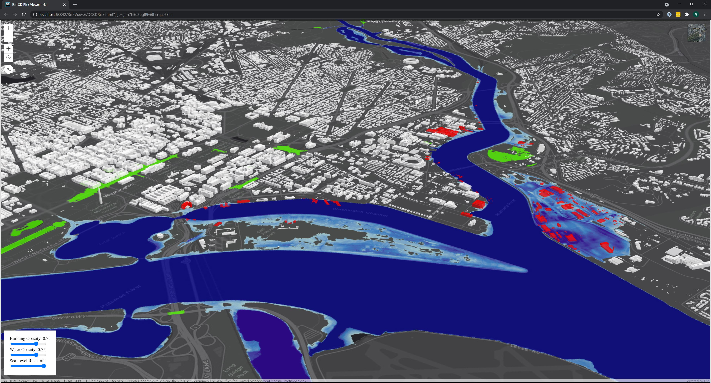

# RiskViewer

  

3D Web-App supporting data processed in the Esri 3D Flood Solution: https://doc.arcgis.com/en/arcgis-solutions/reference/introduction-to-flood-impact-analysis.htm

Showcased in the following articles: 
- Leveraging web 3d for Street Level forcasts: https://www.esri.com/about/newsroom/arcuser/leveraging-web-3d-for-street-level-flood-forecasts/
- A growing city tackles sea level rise: https://gcn.com/articles/2017/05/25/miami-sea-level-rise.aspx
